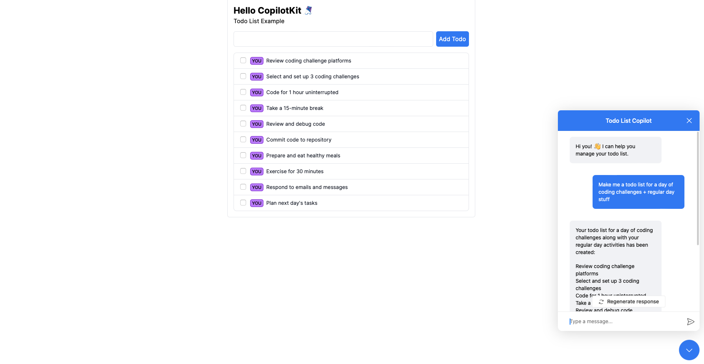

This is a demo that showcases using CopilotKit to build a simple Todo app.

## Run the live demo

Want to see CopilotKit in action? Click the button below to try the live demo.

<a href="https://todo-demo-phi.vercel.app">
  
</a>

<a href="https://todo-demo-phi.vercel.app">
  
</a>

## Deploy with Vercel

To deploy with Vercel, click the button below:

[](https://vercel.com/new/clone?repository-url=https%3A%2F%2Fgithub.com%2FCopilotKit%2Fdemo-todo&env=NEXT_PUBLIC_COPILOT_CLOUD_API_KEY&project-name=copilotkit-demo-todo&repository-name=copilotkit-demo-todo)

## How to Build: a To-Do list app with an embedded AI copilot

Learn how to create a To-Do list app with an embedded AI copilot. This tutorial will guide you through the process step-by-step.

Tutorial: [How to Build: a To-Do list app with an embedded AI copilot](https://dev.to/copilotkit/how-to-build-an-ai-powered-to-do-list-nextjs-gpt4-copilotkit-20i4)

## Add your OpenAI API key

Add your environment variables to `.env.local` in the root of the project.

```
OPENAI_API_KEY=your-api-key
```

## Install dependencies

```bash
npm install
```

## Run the development server

```bash
npm run dev
```

## Open the demo

Open [http://localhost:3000](http://localhost:3000) with your browser to see the result.

## Customize chat and update tasks

The task list supports adding tasks, toggling completion, editing task text and
assignees, and deleting tasks. Choose **Edit**, change the fields, then **Save**.
**Cancel** or Escape discards the draft and preserves the task, including its
assignee. Clearing the assignee and saving explicitly unassigns the task.
Only edited fields are saved, so an unrelated Copilot update is preserved.

The chat provides a custom multiline input, user messages, system notices and
typing indicator. Enter sends, Shift+Enter inserts a newline, and IME composition
does not submit a message. Failed sends restore the draft. Use **Stop response**
to cancel generation or **Retry response** to retry the last response. Requests
are stopped after 60 seconds. Check the task list before retrying a failed turn:
some task actions may have completed before the response failed.

Task text is limited to 500 characters, assignees to 80 characters, and chat input
to 4,000 characters. Tasks remain in memory for the mounted list and reset on
page reload. Database persistence and multi-user synchronization are not included.

### CopilotKit integration

This app retains CopilotKit **1.0.0-beta.2**. That version exposes `Input` and
`Messages` component overrides on `CopilotPopup`, rather than separate slots for
each message type. `CustomMessages` composes the custom message components and
preserves registered action renderers, Markdown and response controls.
`CustomSystemMessage` renders welcome, action and error notices; internal
messages with `role: system` are never displayed. Assistant responses retain
Markdown rendering without raw HTML execution.

The beta's popup send function does not await the completion request, and its
runtime stream adapter can discard transport errors. `TodoCopilot` therefore
uses one public `useCopilotChat` instance for send/retry/stop, awaits completion,
and checks the committed transcript for a new, completed assistant response.
An empty or unfinished response is reported as failure, not silently accepted.

| File | Responsibility |
| --- | --- |
| `src/app/page.tsx` | Provider and page composition |
| `src/components/common/TodoList.tsx` | Add form, list and task progress |
| `src/components/common/TodoItem.tsx` | Inline editing, completion and deletion |
| `src/components/chat/TodoChat/` | Popup integration and custom chat components |
| `src/hooks/useTodos.ts` | React subscription to an isolated task store |
| `src/stores/todoStore.ts` | Synchronous mutations and input validation |
| `src/hooks/useTodoCopilot.ts` | Readable context and three frontend actions |
| `src/app/api/copilotkit/route.ts` | Existing runtime endpoint |

The store is created per list, not as a shared server singleton. React subscribes
with `useSyncExternalStore`, allowing UI handlers and tool handlers to read the
latest snapshot and return an immediate result without side effects in React
state updaters. Native form controls are used because the original application
has no shared form component library.

### Action contracts

| Action | Contract |
| --- | --- |
| `updateTodo` | Edit an existing task by exact `id`; missing IDs return `NOT_FOUND` |
| `updateTodoList` | Preserve the existing add/update batch action; accept 1–100 items and validate the whole batch before applying it |
| `deleteTodo` | Delete an existing task by exact `id` |

Omit unchanged fields. Send `assignedTo: ""` to unassign; omission preserves the
current assignee. New batch items require non-empty text and default to incomplete.
Duplicate IDs in a batch are rejected. Deleted IDs are remembered for the mounted
list so delayed batch calls cannot recreate those tasks. Validation rejects invalid
types, unsupported fields and empty or oversized text. Results contain `ok` and
`message`; failures also contain `INVALID_INPUT` or `NOT_FOUND` in `code`.

### Verification

Run commands from `practices/todo`:

```bash
npm ci
npm test
npm run typecheck
npm run lint
npm run build
```

Use Node 22.14+ for the tested development environment. `npm run test:watch`
starts interactive test mode. Vitest and React Testing Library cover task
mutations, real Copilot action registration/readable context, inline editing,
chat input, rendering, cancellation, timeout and empty-stream recovery.
The kit's example files are excluded from application TypeScript and test discovery.

`next/font/google` downloads Inter during a build, so building requires access to
Google Fonts. The API key is needed for live AI requests, not for the unit tests
or static page build. Keep it in `practices/todo/.env.local` and restart the server
after changing environment variables.

Manual acceptance checks:

1. Add a task, edit its name and assignee, save, then mark it completed.
2. Edit again, clear the assignee, and cancel: the assignee must remain.
3. Save empty task text: the editor must show an error and retain the draft.
4. Ask Copilot to rename, complete and unassign that task; confirm the list changes.
5. Edit a task directly, then ask Copilot about it; confirm the new data is readable.
6. Exercise failed requests and Stop response; the typing indicator must end.
7. Check desktop/mobile layouts, keyboard focus and closing/reopening chat.

See [IMPLEMENTATION_PLAN.md](./IMPLEMENTATION_PLAN.md) for scope and implementation
decisions, and [VERIFICATION.md](./VERIFICATION.md) for executed checks and remaining gaps.

### Browser warning: `Extra attributes from the server: bis_skin_checked`

This attribute is not generated by the application. A direct check of the running
server response and a clean browser tab found no such attribute; the clean tab also
reported no hydration warnings. The reported warning is consistent with browser
software injecting the attribute before React hydrates the page. The phrase
"from the server" refers to the DOM React encounters during hydration, which may
already have been modified after the HTTP response arrived.

Open the app in a fresh browser profile without extensions, or in a private window
where extensions are not enabled, and reload the page. If the warning disappears,
identify the extension or browser integration that modifies the page and adjust
its site access for the local development origin. Keep normal protection settings
for other sites. If it persists in a clean profile, compare the raw HTTP response
with the Elements DOM to investigate software injecting HTML outside extensions.

Avoid adding the injected attribute to JSX, disabling SSR, or applying
`suppressHydrationWarning` throughout the app: those approaches hide or bypass the
mismatch rather than removing its source. The `TodoList` test suite verifies that
unmodified server HTML hydrates without warnings.

Reference: [Next.js hydration errors and browser extensions](https://nextjs.org/docs/messages/react-hydration-error).
