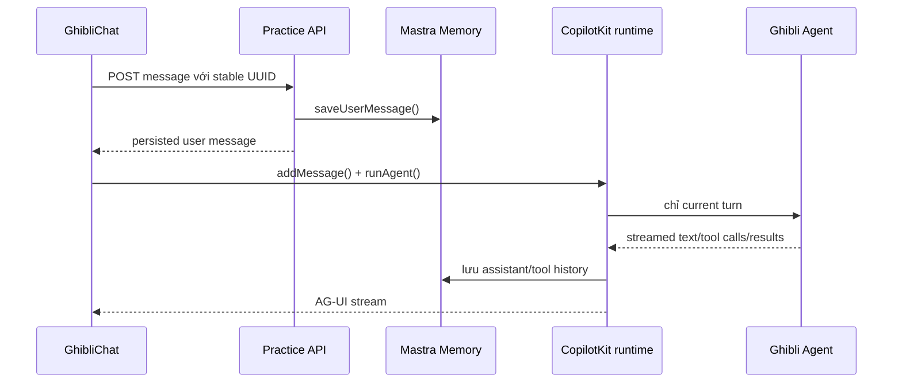

# Tài liệu triển khai Ghibli Practice

## 1. Mục tiêu

Phần practice mở rộng boilerplate [`mastra-ai/ui-dojo`](https://github.com/mastra-ai/ui-dojo) bằng một workspace chat tại:

```text
/practice/ghibli
/practice/ghibli/chat/:threadId
```

Workspace sử dụng React, CopilotKit v2, AG-UI, Mastra và LibSQL. Người dùng có thể điều khiển giao diện bằng hội thoại, quản lý conversation, làm việc với file đính kèm, quản lý Ghibli watchlist và tiếp tục conversation sau khi tải lại trang.

Tài liệu này mô tả code đã triển khai cho các yêu cầu của practice. Kết quả test chi tiết nằm trong [practice-acceptance.md](practice-acceptance.md).

## 2. Các yêu cầu đã hoàn thành

| Yêu cầu                          | Cách triển khai chính                                                                                            | Code liên quan                                                                                                              |
| -------------------------------- | ---------------------------------------------------------------------------------------------------------------- | --------------------------------------------------------------------------------------------------------------------------- |
| Toggle theme tool                | Frontend tool `set_theme` nhận `light`, `dark`, `system` hoặc `toggle`                                           | `src/components/practice/practice-tools.tsx`                                                                                |
| Collapse/expand sidebar tool     | Frontend tool `set_conversation_sidebar`; trạng thái desktop được lưu trong `localStorage`                       | `src/components/practice/practice-tools.tsx`, `src/pages/practice/ghibli.tsx`                                               |
| Search popup tool                | Frontend tool `open_conversation_search`, phím tắt `Ctrl/Cmd + K`, tìm theo title và toàn bộ message đã lưu      | `src/components/practice/conversation-search.tsx`, `src/mastra/services/conversations.ts`                                   |
| Show and extract attached file   | Upload/preview/download ở UI; tool `show_attachment` mở file và server tool `extract_attachment` trích xuất text | `src/components/practice/attachment-preview.tsx`, `src/mastra/services/attachments.ts`, `src/mastra/services/extraction.ts` |
| Delete conversation              | Tool chỉ mở hộp thoại xác nhận; API xóa thread, message và file sau khi người dùng xác nhận                      | `src/components/practice/practice-tools.tsx`, `src/pages/practice/ghibli.tsx`, `src/mastra/routes/practice.ts`              |
| Archive/unarchive                | Server tool `update_conversation` và menu conversation cùng dùng một service cập nhật metadata                   | `src/mastra/tools/practice-tools.ts`, `src/mastra/services/conversations.ts`                                                |
| Edit title                       | Cập nhật `title` bằng `PATCH /practice/threads/:id` hoặc tool `update_conversation`                              | `src/components/practice/conversation-sidebar.tsx`, `src/mastra/tools/practice-tools.ts`                                    |
| Pin/unpin                        | Lưu `pinnedAt` trong metadata; conversation được sắp xếp pinned trước                                            | `src/mastra/services/conversations.ts`                                                                                      |
| Show/add/remove Ghibli watchlist | UI panel và ba agent tools dùng chung `WatchlistService`                                                         | `src/components/practice/watchlist-panel.tsx`, `src/mastra/services/watchlist.ts`                                           |
| Suggestions cho mọi feature      | Registry sinh suggestion theo trạng thái hiện tại và hiển thị trong “All features”                               | `src/lib/practice/suggestions.ts`, `src/components/practice/ghibli-chat.tsx`                                                |
| Save/restore message             | Mastra Memory là nguồn lịch sử chuẩn; message được lưu trước khi gọi model và hydrate lại bằng stable IDs        | `src/mastra/services/practice-memory.ts`, `src/mastra/services/practice-messages.ts`                                        |

## 3. Kiến trúc tổng thể

```mermaid
flowchart LR
  U[Người dùng] --> P[Ghibli Practice page]
  P --> C[CopilotKit v2 / AG-UI]
  P --> A[Practice REST API]
  C --> R[/practice/copilotkit]
  R --> G[Ghibli Agent]
  G --> FT[Frontend tools]
  G --> ST[Mastra server tools]
  FT --> P
  ST --> S[Practice services]
  A --> S
  S --> M[Mastra Memory / LibSQL]
  S --> D[Practice tables / LibSQL]
  S --> F[Upload directory]
  S --> X[Bounded extractor process]
  G --> API[Ghibli API]
```

Thiết kế chia code thành ba lớp:

1. **UI và frontend tools**: thay đổi state của trình duyệt hoặc mở dialog.
2. **Agent, API và services**: validate request, kiểm tra quyền sở hữu resource, xử lý nghiệp vụ và streaming.
3. **Persistence**: Mastra Memory lưu thread/message; các bảng practice lưu watchlist và metadata file; nội dung file nằm trong upload directory.

## 4. Frontend và các tool điều khiển UI

### 4.1 Trang Ghibli Practice

`src/pages/practice/ghibli.tsx` là composition root của practice page. Component này:

- tải danh sách active/archived conversations bằng React Query;
- tạo, chọn, sửa và xóa conversation;
- quản lý trạng thái sidebar, search dialog, watchlist dialog và file preview;
- nhớ conversation cuối cùng qua `practice-last-thread`;
- nhớ trạng thái sidebar desktop qua `practice-sidebar`;
- mở search bằng `Ctrl/Cmd + K`;
- mount một `CopilotKit` riêng theo `thread.id` để khi đổi conversation, phiên cũ được hủy và state agent được khởi tạo lại sạch.

```tsx
<CopilotKit
  key={thread.data.id}
  agent="ghibliAgent"
  runtimeUrl={practiceUrl("/copilotkit")}
>
  <GhibliChat thread={thread.data} ... />
</CopilotKit>
```

Hai route được đăng ký trong `src/App.tsx`:

```tsx
<Route path="/practice/ghibli" element={<GhibliPracticePage />} />
<Route path="/practice/ghibli/chat/:threadId" element={<GhibliPracticePage />} />
```

### 4.2 Frontend tools

`PracticeTools` đăng ký các tool bằng CopilotKit:

| Tool                       | Input                                                 | Tác dụng                                        |
| -------------------------- | ----------------------------------------------------- | ----------------------------------------------- |
| `set_theme`                | `{ mode: "light" \| "dark" \| "system" \| "toggle" }` | Gọi `setTheme` và trả về theme mới              |
| `set_conversation_sidebar` | `{ expanded: boolean }`                               | Mở/đóng sidebar desktop hoặc mobile sheet       |
| `open_conversation_search` | `{ query?, includeArchived? }`                        | Mở search popup với query và scope ban đầu      |
| `show_attachment`          | `{ attachmentId: UUID }`                              | Chỉ mở file thuộc conversation hiện tại         |
| `delete_conversation`      | `{ threadId: UUID }`                                  | Mở bước xác nhận xóa, không tự động xóa dữ liệu |

Ví dụ cách tool theme được triển khai:

```tsx
useFrontendTool({
  name: "set_theme",
  parameters: z.object({
    mode: z.enum(["light", "dark", "system", "toggle"]),
  }),
  handler: async ({ mode }) => {
    const next =
      mode === "toggle"
        ? document.documentElement.classList.contains("dark")
          ? "light"
          : "dark"
        : mode;
    setTheme(next);
    return { theme: next };
  },
});
```

`useAgentContext` chỉ cung cấp data cần thiết cho agent như `threadId`, title, theme, sidebar state và danh sách `{ id, filename }`. Context này được coi là untrusted data trong system instruction của agent.

### 4.3 Search popup

`ConversationSearch` debounce input 250 ms, hỗ trợ ba scope `active`, `archived`, `all` và phân trang kết quả. Search không chỉ lọc những item đã tải ở client; `ConversationService.list()` quét các thread và message đã lưu ở server.

Thứ tự kết quả:

1. pinned conversation trước;
2. `updatedAt` mới nhất trước;
3. `id` làm tie-breaker ổn định.

Khi match trong message, API trả thêm một đoạn `snippet` quanh từ khóa.

## 5. Quản lý conversation

### 5.1 Data model

```ts
type Conversation = {
  id: string;
  title: string;
  createdAt: string;
  updatedAt: string;
  archivedAt: string | null;
  pinnedAt: string | null;
  snippet?: string;
};
```

Mastra thread là bản ghi chuẩn. `archivedAt` và `pinnedAt` được lưu trong `thread.metadata`, còn title dùng field chuẩn của thread.

`threadPatchSchema` là partial patch có validate:

```ts
{
  title?: string;    // 1–120 ký tự
  archived?: boolean;
  pinned?: boolean;
}
```

Các field không được gửi lên sẽ được giữ nguyên. `ConversationService.update()` serialize mutation theo từng thread, vì vậy rename, pin và archive chạy gần nhau không ghi đè metadata của nhau.

### 5.2 UI action và agent action dùng chung service

- Menu ở `ConversationSidebar` gọi REST API.
- Ghibli agent gọi server tool `update_conversation`.
- Cả hai đường đi đều kết thúc tại `ConversationService.update()`.

Điều này bảo đảm hành vi rename/archive/pin giống nhau dù thao tác bằng nút hay bằng câu lệnh chat.

### 5.3 Delete an toàn

Delete được tách làm hai bước:

1. Agent gọi `delete_conversation` để mở dialog.
2. Người dùng xác nhận thì UI gọi `DELETE /practice/threads/:id`.

Conversation đang stream không thể bị xóa. Khi xóa thành công, service xóa attachment của thread trước rồi xóa Mastra thread; watchlist không bị ảnh hưởng.

Archived conversation vẫn đọc được nhưng không nhận message, file hoặc agent run mới cho đến khi unarchive.

## 6. Ghibli agent và watchlist

### 6.1 Agent tools

`src/mastra/agents/ghibli-agent.ts` cấu hình model `openai/gpt-5-mini`, Mastra Memory và các tools:

| Tool                    | Vai trò                                         |
| ----------------------- | ----------------------------------------------- |
| `ghibli-films`          | Lấy danh sách/thông tin phim từ Ghibli API      |
| `ghibli-characters`     | Lấy thông tin nhân vật                          |
| `list_watchlist`        | Đọc watchlist hiện tại                          |
| `add_watchlist_film`    | Thêm phim bằng UUID có thật trong catalog       |
| `remove_watchlist_film` | Xóa phim khỏi watchlist                         |
| `find_conversations`    | Tìm conversation theo title hoặc persisted text |
| `update_conversation`   | Rename, archive/unarchive, pin/unpin            |
| `extract_attachment`    | Trích xuất text của attachment theo từng chunk  |

Agent instruction yêu cầu không tự tạo film ID, file ID hoặc tool result; chỉ báo thành công sau khi tool thực sự thành công. Các UI-only request không gọi nhầm movie tools.

### 6.2 Watchlist persistence

`WatchlistPanel` và agent tools cùng sử dụng `WatchlistService`:

- catalog được lấy từ endpoint cố định `https://ghibliapi.vercel.app/films`;
- response được validate bằng Zod và cache 5 phút;
- chỉ film ID có thật trong catalog mới được thêm;
- unique key `(resource_id, film_id)` làm thao tác add idempotent;
- remove lặp lại trả `not_found` thay vì gây lỗi;
- watchlist dùng chung cho mọi conversation của practice resource.

## 7. File đính kèm và text extraction

### 7.1 Luồng upload và bind

1. Người dùng chọn tối đa ba file cho một message.
2. UI upload từng file đến `POST /practice/threads/:id/attachments`.
3. Server validate extension, size và magic bytes rồi ghi file bằng UUID do server tạo.
4. Khi gửi message, client gửi `attachmentIds` cùng một stable message ID.
5. Server validate toàn bộ batch, lưu user message, sau đó bind attachment với message.
6. File và liên kết vẫn tồn tại sau khi reload.

Các định dạng hỗ trợ: `.txt`, `.md`, `.pdf`, `.docx`. Giới hạn mỗi file là 10 MiB.

### 7.2 Preview và extract

`show_attachment` mở `AttachmentPreview`. Dialog này có thể:

- hiển thị text đã extract;
- tải file gốc;
- nhúng PDF gốc trong sandboxed iframe;
- duyệt nội dung theo chunk 20.000 ký tự;
- hiển thị character range và page provenance.

Agent có thể gọi `extract_attachment` với `offset`. Response có `nextOffset` để đọc tiếp mà không đưa toàn bộ tài liệu lớn vào một tool result.

### 7.3 Biện pháp bảo vệ extractor

Document parser chạy trong child process tách biệt:

- deadline 20 giây;
- tối đa hai job đồng thời;
- Node heap 256 MiB;
- tối đa 2.000.000 ký tự kết quả;
- PDF tối đa 500 trang;
- kiểm tra tổng uncompressed size và số entry của DOCX;
- không nhận path hoặc URL từ request, chỉ nhận bytes qua `stdin`;
- PDF scan không có text trả lỗi cần OCR; practice không hỗ trợ OCR.

Kết quả extract hoàn chỉnh được cache trong `practice_attachments.extraction_json`; API chỉ trả chunk đang được yêu cầu.

Draft upload chưa gắn vào message được dọn sau 24 giờ khi có upload tiếp theo. File đã gắn chỉ bị xóa cùng conversation.

## 8. Suggestions showcase

`getPracticeSuggestions()` sinh suggestion theo state hiện tại thay vì hard-code một danh sách tĩnh không thể chạy:

- light/dark theme;
- collapse/expand sidebar;
- search conversation;
- show watchlist;
- upload document;
- rename conversation;
- pin/unpin;
- archive và tìm archived conversation để restore;
- delete;
- hỏi thông tin Ghibli;
- add một film chưa có trong watchlist;
- remove một film đang có;
- show và extract file sau khi đã upload.

Bốn suggestion đầu hiển thị ngay dưới chat. Nút **All features** mở gallery đầy đủ. Suggestion dùng chính chat/tool flow thật; upload suggestion mở file picker trực tiếp.

Ví dụ inverse suggestion:

```ts
{
  id: "theme",
  label: dark ? "Light theme" : "Dark theme",
  prompt: `Switch to ${dark ? "light" : "dark"} theme.`,
}
```

## 9. Lưu và khôi phục message

### 9.1 Nguồn dữ liệu chuẩn

Mastra Memory với `LibSQLStore` là nguồn lịch sử chuẩn:

```ts
export const practiceMemory = new Memory({
  storage: getStorage(),
  options: { generateTitle: false, lastMessages: 40 },
});
```

Mặc định database là `file:./.mastra-demo.db`; có thể đổi bằng `TURSO_DATABASE_URL`.

### 9.2 Luồng gửi message



User message được lưu **trước** model request. Nếu retry dùng cùng ID và cùng nội dung, thao tác là idempotent. Cùng ID nhưng khác thread hoặc khác nội dung bị từ chối.

Runtime chỉ gửi current user turn và các frontend-tool continuation sau nó:

```ts
export function currentTurnMessages(messages: Message[]): Message[] {
  for (let index = messages.length - 1; index >= 0; index--) {
    if (messages[index].role === "user") return messages.slice(index);
  }
  return [];
}
```

Lịch sử cũ đã có trong Mastra Memory, nên không gửi ngược toàn bộ restored history vào mỗi model request. Cách này tránh tool call cũ bị hiểu nhầm là hành động mới.

### 9.3 Restore khi mở lại conversation

`GET /practice/threads/:id/messages?page=n` đọc 50 message mỗi trang và trả theo thứ tự thời gian. `restoreMessages()` chuyển Mastra message parts sang AG-UI messages:

- giữ stable message ID;
- phục hồi text và reasoning;
- phục hồi assistant tool calls;
- tạo tool result message với ID ổn định;
- tool call cũ chưa hoàn thành được hiển thị là interrupted result, không tự chạy lại.

`GhibliChat` hydrate page mới nhất trước khi mount runtime. Người dùng có thể tải các page cũ hơn bằng **Load earlier messages**. Khi đổi thread hoặc unmount, `AbortController.abort()` và `copilotkit.stopAgent()` hủy request đang chạy.

### 9.4 Run lease

`ConversationService.beginRun()` giữ một process-local lease theo thread:

- không cho hai response chạy đồng thời trên một conversation;
- không chạy trên archived/deleted thread;
- delete và write bị chặn trong khi agent đang stream;
- lease được release khi stream kết thúc, bị cancel hoặc có lỗi.

## 10. Database schema

Migration là additive và không sửa bảng do Mastra quản lý:

```sql
CREATE TABLE IF NOT EXISTS practice_watchlist (
  resource_id TEXT NOT NULL,
  film_id TEXT NOT NULL,
  film_json TEXT NOT NULL,
  added_at TEXT NOT NULL,
  PRIMARY KEY(resource_id, film_id)
);

CREATE TABLE IF NOT EXISTS practice_attachments (
  id TEXT PRIMARY KEY,
  resource_id TEXT NOT NULL,
  thread_id TEXT NOT NULL,
  message_id TEXT,
  filename TEXT NOT NULL,
  media_type TEXT NOT NULL,
  size INTEGER NOT NULL CHECK(size > 0 AND size <= 10485760),
  created_at TEXT NOT NULL,
  extraction_json TEXT
);
```

`PRACTICE_RESOURCE_ID` là identity do server sở hữu, mặc định `ui-dojo-practice`. Client và model không được tự chọn resource này. Đây là thiết kế single-user cho practice; multi-user production cần thay bằng authenticated identity.

## 11. REST API

Base URL mặc định: `http://localhost:4750/practice`.

| Method   | Endpoint                           | Chức năng                             |
| -------- | ---------------------------------- | ------------------------------------- |
| `GET`    | `/threads?query=&scope=&page=`     | List/search conversations             |
| `POST`   | `/threads`                         | Tạo conversation                      |
| `GET`    | `/threads/:id`                     | Đọc conversation                      |
| `PATCH`  | `/threads/:id`                     | Rename/archive/pin bằng partial patch |
| `DELETE` | `/threads/:id`                     | Xóa conversation, message và file     |
| `GET`    | `/threads/:id/messages?page=`      | Đọc persisted messages                |
| `POST`   | `/threads/:id/messages`            | Lưu user message và bind attachments  |
| `GET`    | `/films`                           | Đọc catalog đã validate               |
| `GET`    | `/watchlist`                       | Đọc watchlist                         |
| `PUT`    | `/watchlist/:filmId`               | Thêm film                             |
| `DELETE` | `/watchlist/:filmId`               | Xóa film                              |
| `GET`    | `/threads/:id/attachments`         | List attachment của thread            |
| `POST`   | `/threads/:id/attachments`         | Upload attachment                     |
| `POST`   | `/threads/:id/attachments/bind`    | Bind draft file với message           |
| `GET`    | `/attachments/:id`                 | Download/preview file gốc             |
| `DELETE` | `/attachments/:id`                 | Xóa draft attachment                  |
| `GET`    | `/attachments/:id/extract?offset=` | Extract một chunk text                |
| `POST`   | `/copilotkit`                      | CopilotKit single-route runtime       |

`practiceBoundary()` chuẩn hóa lỗi validation/domain thành response an toàn. Lỗi nội bộ chỉ trả generic message và `requestId`; chi tiết lỗi không bị lộ cho client.

## 12. Những file quan trọng

```text
src/
├─ pages/practice/ghibli.tsx                 # page shell và conversation lifecycle
├─ components/practice/
│  ├─ ghibli-chat.tsx                        # chat, upload, suggestions, hydrate/abort
│  ├─ practice-tools.tsx                     # CopilotKit frontend/render tools
│  ├─ conversation-sidebar.tsx               # CRUD controls
│  ├─ conversation-search.tsx                # persisted search dialog
│  ├─ attachment-preview.tsx                 # preview/download/extraction chunks
│  └─ watchlist-panel.tsx                    # catalog và watchlist UI
├─ lib/practice/
│  ├─ contracts.ts                           # schemas, limits và shared types
│  ├─ api.ts                                 # browser API wrapper
│  ├─ agent-session.ts                       # hydrate thread/messages vào agent
│  ├─ run-messages.ts                        # chỉ gửi current turn
│  └─ suggestions.ts                         # feature suggestion registry
└─ mastra/
   ├─ agents/ghibli-agent.ts                 # model, instructions và server tools
   ├─ tools/practice-tools.ts                # watchlist/conversation/file tools
   ├─ routes/practice.ts                     # REST + CopilotKit runtime routes
   ├─ repositories/practice-database.ts      # additive schema migration
   └─ services/
      ├─ conversations.ts                    # ownership, CRUD, search, run lease
      ├─ practice-memory.ts                  # Mastra Memory configuration
      ├─ practice-messages.ts                # Mastra → AG-UI restoration
      ├─ watchlist.ts                        # validated Ghibli catalog + persistence
      ├─ attachments.ts                      # upload/bind/read/cache/cleanup
      └─ extraction.ts                       # bounded child-process extraction
```

## 13. Cấu hình và chạy local

Yêu cầu Node.js 22 và pnpm version đã khóa trong repository:

```bash
npx pnpm@10.18.2 install --frozen-lockfile
```

Tạo `.env` từ `.env.example` và điền `OPENAI_API_KEY`, sau đó:

```bash
npm run dev
```

Các biến tùy chọn:

| Biến                      | Mặc định / mục đích                                  |
| ------------------------- | ---------------------------------------------------- |
| `PRACTICE_RESOURCE_ID`    | `ui-dojo-practice`                                   |
| `TURSO_DATABASE_URL`      | `file:./.mastra-demo.db`                             |
| `TURSO_AUTH_TOKEN`        | Token nếu dùng remote database                       |
| `PRACTICE_UPLOAD_DIR`     | `.practice-uploads`                                  |
| `PRACTICE_EXTRACTOR_PATH` | Đường dẫn tuyệt đối đến extractor khi đóng gói riêng |
| `VITE_MASTRA_BASE_URL`    | `http://localhost:4750`                              |

## 14. Kiểm tra chất lượng

```bash
npm test
npm run typecheck
npm run lint
npm run vite:build
npm run mastra:build

# Chạy khi local Mastra server đang hoạt động
npm run test:api
```

Test suite bao phủ conversation CRUD, concurrent metadata merge, message restore, watchlist idempotency, file validation, TXT/Markdown/PDF/DOCX extraction, pagination, ownership isolation và cleanup khi xóa.

## 15. Giới hạn hiện tại

- Practice dùng một server-owned resource cho demo single-user, chưa có authentication multi-user.
- Run lease nằm trong process, chưa phải distributed lock cho nhiều server instance.
- File dùng local disk; production nhiều instance cần shared/object storage.
- Search quét persisted messages theo page, chưa dùng full-text index.
- PDF scan cần OCR, nhưng OCR không nằm trong phạm vi practice.
- Khi backup hoặc di chuyển hệ thống, phải giữ database và upload directory cùng nhau.
