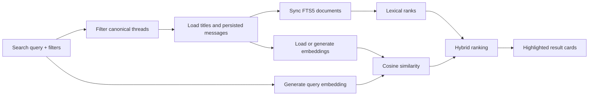

# Semantic conversation search

Ngày: 2026-10-02

Trạng thái: Completed

## 1. Bối cảnh

Search ban đầu duyệt toàn bộ Mastra threads/messages và chỉ so khớp chuỗi. Cách này tìm được từ khóa chính xác nhưng không nhận ra những câu có cùng ý nghĩa, không có date/attachment filters, không highlight đoạn liên quan và kết quả tool của agent chỉ hiển thị dưới dạng JSON mặc định.

Ví dụ, query `forest spirit` không thể tìm message `Totoro waits beside the Catbus` nếu chỉ dùng substring search.

## 2. Yêu cầu cải tiến

- Tạo embeddings cho conversation title và persisted text messages.
- Kết hợp full-text search với semantic search.
- Highlight đoạn message liên quan.
- Thêm filter theo ngày cập nhật, attachment và archive status.
- Render kết quả `find_conversations` thành UI cards trong chat.

## 3. Kết quả

Search mới có ba chế độ:

| Chế độ    | Điều kiện                                       | Hành vi                                                          |
| --------- | ----------------------------------------------- | ---------------------------------------------------------------- |
| `browse`  | Query rỗng                                      | Filter và phân trang conversations, không gọi embedding provider |
| `hybrid`  | Query khác rỗng và embedding provider hoạt động | Kết hợp FTS5 rank với cosine similarity                          |
| `lexical` | Embedding provider/API key không khả dụng       | Tiếp tục tìm bằng FTS5 thay vì làm request thất bại              |

Kết quả trả về có thể chứa:

```ts
type ConversationSearchResult = Conversation & {
  snippet?: string;
  snippetHighlights?: { start: number; end: number }[];
  matchSource?: "title" | "message";
  matchedMessageId?: string;
  lexicalScore?: number;
  semanticScore?: number;
  score?: number;
  attachmentCount: number;
};
```

## 4. Kiến trúc



Mastra Memory vẫn là nguồn conversation/message chuẩn. FTS rows và embeddings chỉ là derived indexes; chúng có thể được tạo lại từ canonical data.

## 5. Full-text search

Migration tạo virtual table FTS5:

```sql
CREATE VIRTUAL TABLE IF NOT EXISTS practice_search_fts USING fts5(
  resource_id UNINDEXED,
  thread_id UNINDEXED,
  source_type UNINDEXED,
  source_id UNINDEXED,
  content,
  tokenize='unicode61 remove_diacritics 2'
);
```

Trước mỗi non-empty search, các document rows của candidate threads được đồng bộ lại từ Mastra Memory. Việc rebuild được serialize trong một process-local queue để hai search đồng thời không tạo duplicate rows.

Query được tokenize thành tối đa 20 Unicode letter/number tokens và sử dụng prefix matching. FTS results được chuyển thành normalized reciprocal rank trước khi kết hợp với semantic score.

## 6. Semantic embeddings

Embedding model mặc định:

```env
PRACTICE_EMBEDDING_MODEL=text-embedding-3-small
```

Quy tắc tạo embedding:

- embeddings chỉ được tạo khi query khác rỗng;
- title và mỗi message text là một search document riêng;
- mỗi document gửi tới provider được giới hạn 12.000 ký tự;
- requests được batch tối đa 64 inputs;
- timeout là 20 giây;
- browser không bao giờ nhận API key;
- request bị hủy khi HTTP request bị abort hoặc agent bị stop.

Vector được cache trong `practice_search_embeddings`:

```sql
CREATE TABLE IF NOT EXISTS practice_search_embeddings (
  resource_id TEXT NOT NULL,
  thread_id TEXT NOT NULL,
  source_type TEXT NOT NULL,
  source_id TEXT NOT NULL,
  content_hash TEXT NOT NULL,
  model TEXT NOT NULL,
  embedding_json TEXT NOT NULL,
  updated_at TEXT NOT NULL,
  PRIMARY KEY(resource_id, source_type, source_id)
);
```

`content_hash` là SHA-256 của canonical text. Khi title hoặc message thay đổi, hash không còn khớp và vector được tạo lại. Khi model thay đổi, cache của model cũ không được sử dụng.

Nếu provider thất bại, semantic search được cooldown 30 giây để tránh gọi lại liên tục khi người dùng đang gõ. Trong thời gian đó search dùng lexical mode.

## 7. Hybrid ranking

Mỗi document được chấm điểm:

- lexical match: 60%;
- semantic similarity: 40%;
- semantic-only match: cosine similarity phải từ `0.45` trở lên và được nhân hệ số `0.55`.

Document có score cao nhất đại diện cho conversation. Conversations sau đó được sắp xếp theo:

1. hybrid score;
2. pinned state;
3. `updatedAt`.

Các trọng số và threshold nằm tập trung trong `ConversationSearchService`, nên có thể hiệu chỉnh sau khi có relevance evaluation dataset.

## 8. Highlight và UI cards

Với lexical match, server trả plain-text snippet và các character ranges. Client render ranges bằng React `<mark>`; không dùng `dangerouslySetInnerHTML`, vì vậy persisted message không thể inject HTML.

`ConversationSearchCard` được dùng ở hai nơi:

- search dialog;
- `find_conversations` agent tool renderer.

Card hiển thị title, snippet, highlighted segments, pinned/archive state, attachment count, match source, updated time và nút mở conversation.

## 9. Filters

Shared query contract hỗ trợ:

| Field            | Kiểu                        | Ý nghĩa                           |
| ---------------- | --------------------------- | --------------------------------- |
| `query`          | string, tối đa 200 ký tự    | Semantic/full-text query          |
| `scope`          | `active`, `archived`, `all` | Archive filter                    |
| `updatedFrom`    | `YYYY-MM-DD`                | Ngày cập nhật nhỏ nhất, inclusive |
| `updatedTo`      | `YYYY-MM-DD`                | Ngày cập nhật lớn nhất, inclusive |
| `hasAttachments` | boolean                     | Có hoặc không có attachment       |
| `page`           | non-negative integer        | Page 30 kết quả                   |

Filters được áp dụng trước embedding work để giảm số document phải load và gửi tới provider.

## 10. Agent integration

Server tool `find_conversations` dùng cùng `ConversationSearchService` với REST API. Tool nhận query/filter contract giống browser và trả `ConversationSearchPage`.

CopilotKit renderer nhận tool result, validate cấu trúc cơ bản và render interactive cards. Nút **Open** điều hướng trực tiếp đến conversation được chọn.

## 11. Cleanup và reliability

- Khi conversation bị xóa, FTS rows và embedding rows của thread cũng bị xóa.
- Search chỉ làm việc với server-owned `PRACTICE_RESOURCE_ID`.
- Candidate threads luôn được lấy từ canonical owned threads trước khi search.
- Request mới hủy embedding request cũ thông qua `AbortSignal`.
- Corrupt cached vector bị bỏ qua và tạo lại.
- Provider failure không làm mất lexical search.

## 12. Code thay đổi

| File                                                        | Nội dung                                                                           |
| ----------------------------------------------------------- | ---------------------------------------------------------------------------------- |
| `src/mastra/services/conversation-search.ts`                | FTS sync, embedding cache, cosine similarity, hybrid ranking, highlight và filters |
| `src/mastra/repositories/practice-database.ts`              | Migration cho FTS5 và embedding table                                              |
| `src/mastra/services/practice.ts`                           | Shared search-service singleton                                                    |
| `src/mastra/routes/practice.ts`                             | REST search và index cleanup                                                       |
| `src/mastra/tools/practice-tools.ts`                        | Hybrid `find_conversations` agent tool                                             |
| `src/lib/practice/contracts.ts`                             | Filter và search-result schemas/types                                              |
| `src/components/practice/conversation-search.tsx`           | Filter controls và search state                                                    |
| `src/components/practice/conversation-search-card.tsx`      | Shared highlighted result card                                                     |
| `src/components/practice/practice-tools.tsx`                | Agent result-card renderer                                                         |
| `src/mastra/services/__tests__/conversation-search.test.ts` | Deterministic search tests                                                         |

## 13. Kiểm thử

Automated tests dùng deterministic embedding provider, không phụ thuộc network hoặc API key. Test cases bao phủ:

- semantic-only match không có lexical overlap;
- FTS match và highlight ranges;
- reuse cached document embeddings;
- inclusive date range;
- attachment presence;
- active/archived scope;
- cleanup FTS và embedding rows.

Verification ngày 2026-10-02:

```text
npm test             5 files, 12 tests passed
npm run typecheck    passed
npm run lint         passed
Vite build           passed
npm run mastra:build passed
git diff --check     passed
```

## 14. Giới hạn và bước tiếp theo

- Embeddings hiện lưu dưới dạng JSON và cosine similarity chạy trong Node.js. Khi data lớn nên chuyển sang native vector index.
- FTS rows được rebuild lazy trong search request; quy mô lớn nên chuyển indexing sang background job.
- Chưa có relevance benchmark hoặc labeled query dataset để tối ưu trọng số hybrid.
- Embedding text được gửi tới configured OpenAI endpoint; production cần privacy notice và retention policy phù hợp.
- Search theo `updatedAt` date, chưa hỗ trợ created date hoặc arbitrary date range trong message content.

Các bước tiếp theo phù hợp:

1. Viết relevance evaluation dataset và đo Precision@K/NDCG.
2. Index background sau khi title/message được lưu.
3. Dùng native vector index khi số document tăng.
4. Thêm deep link đến đúng message match.
5. Thêm reranker cho top candidates nếu cần độ chính xác cao hơn.
