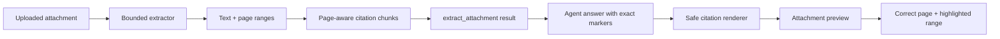

# Clickable document citations

Ngày: 2026-10-05

Trạng thái: Completed

## 1. Bối cảnh

Ghibli Practice đã hỗ trợ upload, trích xuất và preview tài liệu TXT, Markdown, PDF và DOCX. Tuy nhiên, kết quả `extract_attachment` trước đây chỉ trả một đoạn text lớn cùng danh sách page tổng quát. Câu trả lời của agent không thể chỉ rõ claim lấy từ file nào, trang nào và character range nào; người dùng cũng không thể bấm citation để kiểm tra đúng đoạn nguồn.

## 2. Yêu cầu

- Chia nội dung trích xuất thành các chunk có page metadata.
- Tool trả attachment ID, page number và character range cho từng chunk.
- Câu trả lời của agent hiển thị citation có thể bấm.
- Khi bấm citation, mở đúng attachment và focus đúng đoạn nội dung.
- Không cho model biến citation thành đường dẫn filesystem hoặc URL tùy ý.

## 3. Kết quả

Mỗi lần gọi `extract_attachment`, response vẫn giữ trường `text` và continuation `nextOffset` để tương thích với flow cũ, đồng thời bổ sung `chunks`:

```ts
type ExtractionChunk = {
  attachmentId: string;
  filename: string;
  page: number;
  start: number; // zero-based, inclusive
  end: number; // zero-based, exclusive
  text: string;
  citation: string;
};
```

Ví dụ marker mà tool trả cho agent:

```text
【cite:123e4567-e89b-42d3-a456-426614174000:p2:420-861】
```

Marker chứa đúng attachment ID, page và global character range. Agent được yêu cầu copy nguyên marker ngay sau claim được passage hỗ trợ.

## 4. Luồng hoạt động



1. Extractor tạo canonical text và page ranges.
2. `AttachmentService` lấy tối đa 20.000 ký tự cho mỗi tool call.
3. Phần text đó được chia tiếp thành citation chunks tối đa 2.000 ký tự.
4. Chunk không bao giờ đi qua biên trang.
5. Agent đặt marker từ `chunks[].citation` vào câu trả lời.
6. Client đổi marker hợp lệ thành fragment link nội bộ.
7. Citation renderer chặn navigation mặc định và mở preview bằng attachment object đã có trong conversation.
8. Preview tải đoạn text chứa range, highlight chính xác và mở PDF ở đúng page khi có thể.

## 5. Page metadata và chunking

### PDF

PDF.js trích xuất từng trang và lưu range trong canonical text:

```ts
{ page: 2, start: 1840, end: 3672 }
```

`start` và `end` là offsets toàn cục trong toàn bộ extracted text, không phải offsets tương đối của trang.

### TXT, Markdown và DOCX

Các định dạng này không có pagination đáng tin cậy sau khi trích xuất raw text. Hệ thống gán một virtual page rõ ràng:

```ts
{ page: 1, start: 0, end: text.length }
```

Cách này bảo đảm mọi passage đều có provenance ổn định mà không giả lập page breaks không tồn tại.

### Quy tắc chia chunk

- Kích thước tối đa: 2.000 ký tự.
- Ưu tiên cắt ở paragraph, newline, sentence hoặc whitespace gần cuối chunk.
- Không cắt sớm hơn một nửa kích thước mục tiêu chỉ để tìm boundary đẹp.
- Không tạo chunk vượt qua `page.end`.
- Character ranges dùng quy ước half-open `[start, end)`.
- Các extraction cache cũ không có pages được xử lý như virtual page 1 ở service layer.

## 6. Agent integration

Description của `extract_attachment` giải thích rõ mỗi chunk có:

- attachment ID;
- filename;
- page;
- exact character range;
- citation marker.

System instruction của Ghibli agent yêu cầu:

- gọi tool trước khi trả lời từ attachment;
- đặt marker ngay sau claim liên quan;
- copy marker nguyên văn;
- không tự tạo ID, page hoặc range.

Tool result cũng có renderer riêng hiển thị các source-passage buttons. Vì vậy passage vẫn có thể được mở trực tiếp ngay cả khi model không đặt marker trong final prose.

## 7. Safe citation rendering

Client chỉ nhận dạng grammar citation hẹp chứa UUID, positive page và valid range. Marker hợp lệ được chuyển thành fragment dạng:

```text
#attachment-citation:<attachment-id>:p<page>:<start>-<end>
```

Renderer sau đó:

1. parse fragment bằng regex cố định;
2. tìm attachment trong danh sách file của conversation hiện tại;
3. render button thay vì điều hướng tới URL;
4. truyền `{ page, start, end }` cho preview.

Các URL Markdown thông thường vẫn dùng renderer mặc định. Unknown attachment hiển thị `source unavailable`; nó không thể mở file khác hoặc arbitrary path.

Không sử dụng `dangerouslySetInnerHTML`. Filename và extracted text được React escape như text thông thường.

## 8. Preview đúng nguồn

Khi mở từ citation, preview:

- bắt đầu extraction khoảng 400 ký tự trước target để có context;
- chuyển global offsets thành local offsets trong chunk đang hiển thị;
- bọc đúng substring bằng `<mark>`;
- scroll highlight vào giữa vùng preview;
- hiển thị page và character range trong description;
- với PDF, thêm `#page=<n>` vào inline PDF URL và tự mở original PDF panel.

Khi người dùng bấm **Previous text** hoặc **More text**, citation focus được bỏ để chuyển về navigation bình thường.

## 9. API contract

Response `Extraction` hiện có dạng:

```ts
type Extraction = {
  attachmentId: string;
  filename: string;
  text: string;
  offset: number;
  nextOffset: number | null;
  totalCharacters: number;
  pages: { page: number; start: number; end: number }[];
  chunks: ExtractionChunk[];
};
```

Không có database migration. Canonical extraction tiếp tục được cache trong `practice_attachments.extraction_json`.

## 10. Code thay đổi

| File                                                  | Nội dung                                                      |
| ----------------------------------------------------- | ------------------------------------------------------------- |
| `scripts/extract-document.mjs`                        | Page metadata cho mọi supported format                        |
| `src/lib/practice/contracts.ts`                       | Citation, chunk và preview-target types                       |
| `src/lib/practice/citations.ts`                       | Marker encoding, validation và Markdown conversion            |
| `src/mastra/services/attachments.ts`                  | Page-aware chunking và exact ranges                           |
| `src/mastra/tools/practice-tools.ts`                  | Tool description cho citation provenance                      |
| `src/mastra/agents/ghibli-agent.ts`                   | Quy tắc sử dụng exact citation markers                        |
| `src/components/practice/attachment-citation.tsx`     | Safe clickable citation renderer                              |
| `src/components/practice/attachment-preview.tsx`      | Page navigation và range highlight                            |
| `src/components/practice/practice-tools.tsx`          | Interactive extraction-result passages                        |
| `src/components/practice/ghibli-chat.tsx`             | Citation renderer integration                                 |
| `src/pages/practice/ghibli.tsx`                       | Preview state chứa attachment và optional target              |
| `src/lib/practice/citations.test.ts`                  | Marker round-trip và malformed/unknown citation tests         |
| `src/mastra/services/__tests__/business-data.test.ts` | Page-boundary, continuity và attachment extraction assertions |
| `src/mastra/services/__tests__/extraction.test.ts`    | Parser page metadata assertions                               |

## 11. Kiểm thử

Automated tests bao phủ:

- citation marker round-trip sang internal fragment;
- từ chối malformed range và arbitrary URL;
- unknown attachment không trở thành clickable citation;
- chunks ghép lại đúng original extracted slice;
- mỗi chunk nằm hoàn toàn trong đúng page;
- attachment ID, filename, page và range được giữ nguyên;
- PDF và DOCX parser trả page metadata;
- extraction cache vẫn được reuse.

Verification trong lần triển khai:

```text
npm test                         passed
npm run typecheck               passed
npx eslint src scripts/...      passed
npm run vite:build              passed
git diff --check                passed
```

## 12. Giới hạn và bước tiếp theo

- DOCX hiện chỉ có virtual page 1. Muốn citation theo trang thật cần layout engine, không thể suy ra chính xác từ raw OOXML text.
- PDF text order phụ thuộc PDF.js; tài liệu nhiều cột có thể có reading order không tự nhiên.
- PDF scan không có text vẫn yêu cầu OCR và bị từ chối rõ ràng.
- Citation marker do model copy. Tool-result buttons là fallback kiểm chứng, nhưng có thể bổ sung server-side structured citation message part trong tương lai.
- PDF viewer support cho `#page=` phụ thuộc browser; extracted-text highlight vẫn luôn là nguồn kiểm chứng chính.
